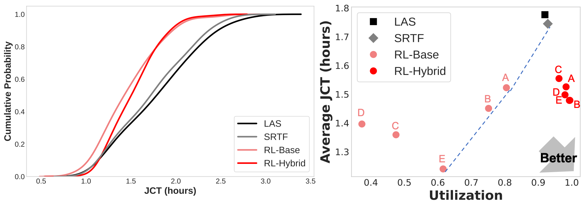
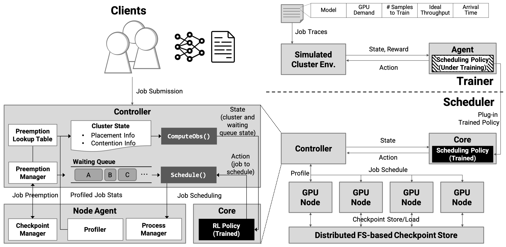

# Network Contention-Aware Cluster Scheduling with Reinforcement Learning [Paper]

DeepShare is a framework for (1) training network contention-aware scheduling policy using RL and (2) deploying it to GPU clusters.

TLDR: Distributed DL training on shared GPU clusters is prone to network contention between training jobs. This is because existing schedulers mainly focus on allocation of <strong>dedicated</strong> computation resources (e.g., GPU) but are often agnostic to <strong>shared</strong> network resources (e.g., PCIe, NVLink, and Infiniband). This can be addressed by incorporating a contention-aware scheduler that dynamically schedules and migrates jobs according to cluster-wide network contention. DeepShare presents an end-to-end system for training such efficient scheduling policies with RL to its deployment on GPU clusters. Scheduling policies trained with DeepShare (RL-base and RL-hybrid in above figure) show that training latency is improved by up to 20.7% compared to state-of-the-art schedulers.

## Getting started

- Refer to [Installation](INSTALL.md) for complete instructions on environment setup and installation.
- Refer to [Quickstart](QUICKSTART.md) for training scheduling policies with RL and deploying on GPU cluster.
- Refer to [Examples](slurm_examples/EXAMPLE.md) for writing custom job scripts.

## Citation
TBD.

## Contact

Junyeol Ryu (junyeol@aces.snu.ac.kr)